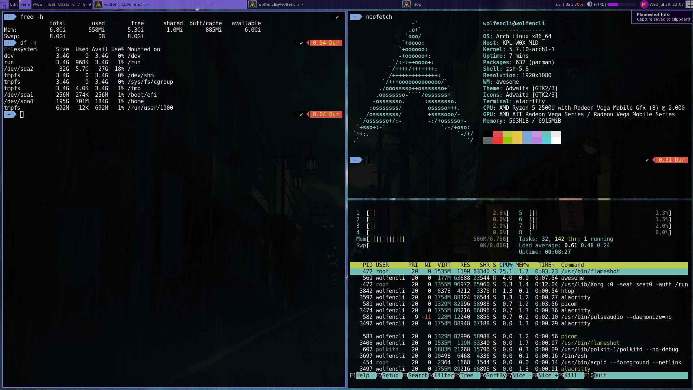
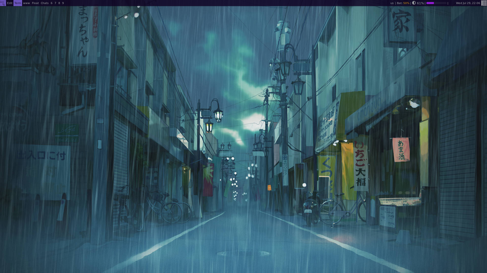

# Awesome Dotfiles
## Personal Dotfiles for AwesomeWM config

### Dependencies
- awesomewm 4 (or later)
- picom
- pulseaudio
- alsa
- acpid
- streetturtle volume widget
- streetturtle brightness widget
- deficient battery widget
- Arc icons
- Alacritty
- zsh/ohmyzsh
- xscreensaver
- flameshot
- powerline-fonts

### Credits
- For the volume widget: https://github.com/streetturtle/awesome-wm-widgets/tree/master/volumebar-widget
- For the brightness widget: https://github.com/streetturtle/awesome-wm-widgets/tree/master/brightness-widget
- For the battery widget: https://github.com/deficient/battery-widget
- Arc icons: https://github.com/horst3180/arc-icon-theme

